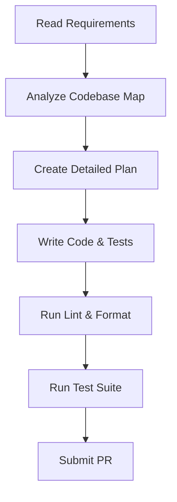

# AI Agent Guidelines — my-nextjs-app

Welcome! This document provides guidelines, conventions, and instruction workflows for AI coding assistants (like Cursor, Claude, Gemini, or Copilot) operating on the **my-nextjs-app** codebase.

---

## 🚀 Tech Stack Profile

This project uses the following technical stack configuration:
- **Frontend Framework**: `Next.js`
- **Backend Framework**: `None`
- **Database**: `None`
- **Authentication**: `NextAuth`
- **State Management**: `Redux`
- **Testing Framework**: `Jest`
- **Package Manager**: `yarn`

---

## 🛠️ Command Reference

Use these commands for development, linting, formatting, and testing. Do **NOT** use alternate commands unless requested.

| Action | Command |
| :--- | :--- |
| **Install Dependencies** | `yarn install` |
| **Run Dev Server** | `yarn run dev` |
| **Build Project** | `yarn run build` |
| **Lint Code** | `yarn run lint` |
| **Format Code** | `yarn run format` |
| **Run Tests** | `yarn run test` |

---

## 📝 Rules of Engagement

> [!IMPORTANT]
> ### 1. Code Style & Architecture
> - Respect the existing directory structure defined in [CODEBASE_MAP.md](CODEBASE_MAP.md).
> - Keep files modular and focused. Avoid giant multi-hundred line files.
> - Do not write generic or boilerplate comments (e.g., `// This function adds two numbers`). Write comments only for non-obvious business logic or architectural decisions.
>
> ### 2. Dependency Management
> - Always install dependencies using **`yarn`**. Never use another package manager.
> - Do not add dependencies without assessing their impact on bundle size or security.
>
> ### 3. Errors and Safety
> - Handle all error paths explicitly. Do not use generic catch-alls (`catch (e) {}`) without logging or handling.
> - Ensure all user input is sanitized and validated. Refer to the standards in [API_CONTRACTS.md](API_CONTRACTS.md).

---

## 🧑‍💻 Task Execution Workflow

Before implementing changes, verify against this workflow:

1. **Understand Context**: Read [ARCHITECTURE.md](ARCHITECTURE.md) and [BUSINESS_RULES.md](BUSINESS_RULES.md).
2. **Implement**: Write cleaner, self-documenting code.
3. **Verify**: Ensure that `yarn run lint` and all tests pass with zero warnings.
