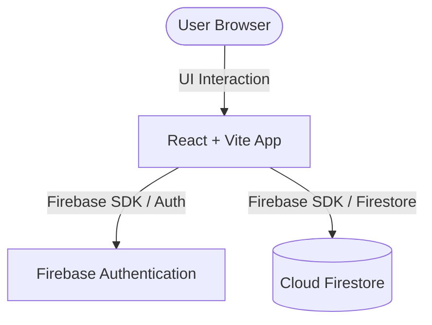

# Architecture Blueprint — my-react-firebase-app
*Generated 2026-05-24 — v0.3.1*
This document details the high-level architecture, data flows, and design decisions for the **my-react-firebase-app** project.

---

## 🏛️ System Overview

The system is configured as follows:
- **Frontend Layer**: `React + Vite`
- **Backend / Integration Layer**: `Firebase`
- **Database Layer**: `Firestore`
- **Authentication**: `Firebase Auth`

---

## 🗺️ System Topology

Here is the flow of user actions and data updates:

---

## 🧱 Layered Architecture

### 1. Presentation Layer (Frontend)
- Built using **`React + Vite`**.
- State management handled by **`Zustand`**.
- Handles client-side routing, user input capture, layout rendering, and local state sync.

### 2. Integration & Backend Layer
- Utilizes a serverless integration pattern using the **Firebase SDK**.
- Security rules are set up at the Firestore/Storage levels to authorize client requests without a separate API server.

### 3. Data & Storage Layer
- Powered by **Cloud Firestore**, a NoSQL document database.
- Key collections are structured around core domain aggregates (see [BUSINESS_RULES.md](BUSINESS_RULES.md)).

---

## 🔒 Security & Data Guardrails

> [!IMPORTANT]
> - **Authentication**: Managed via `Firebase Auth`.
> - **Input Validation**: All data entering the backend boundary or Firestore database must be validated using runtime validation libraries (e.g., Zod, Valibot, or Joi) on both client and backend.
> - **Cors & Headers**: API requests must strictly adhere to the rules outlined in [API_CONTRACTS.md](API_CONTRACTS.md).

---
*Documentation generated by [create-agent-docs](https://github.com/anomalyco/create-agent-docs) v0.3.1 on 2026-05-24.*
